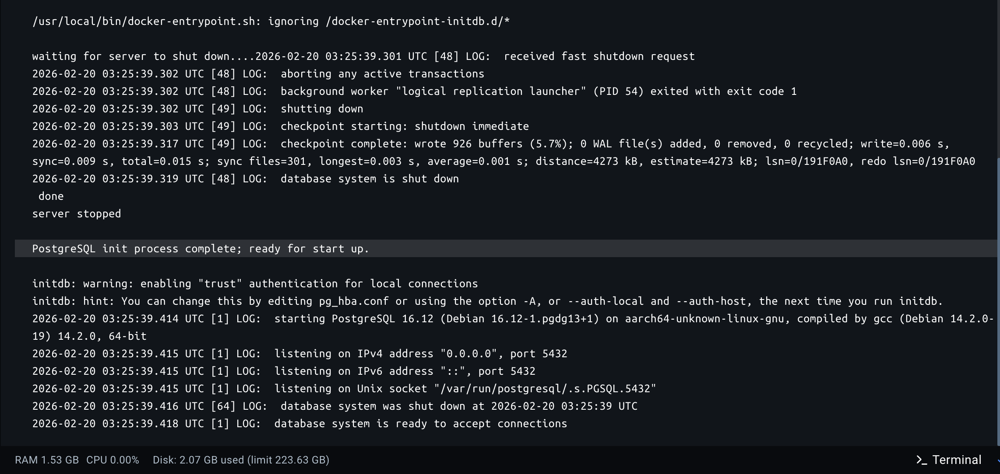
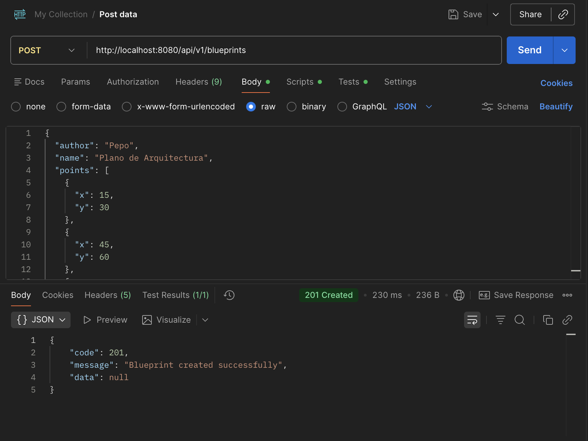
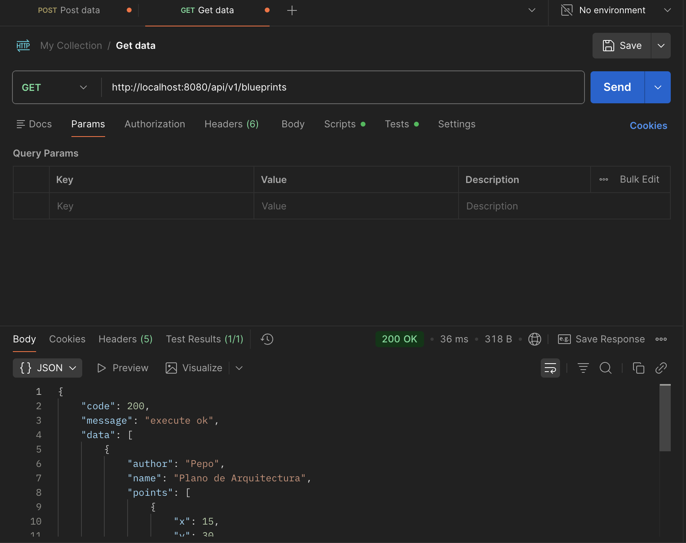
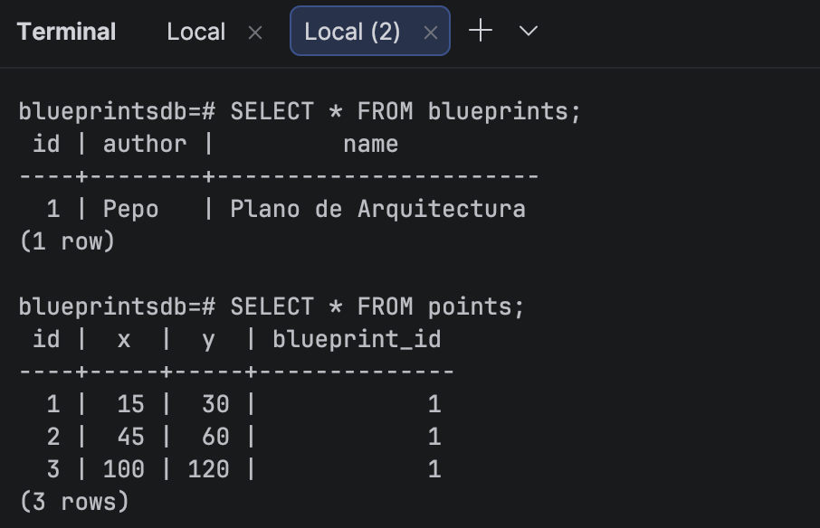

# Laboratorio 4 - BluePrints

**Elaborado Por**

Sebatián Villarraga

Juan Carlos Leal Cruz

## **Actividades del Laboratorio**
### **Parte 1. Familiarización con el código base**
El proyecto está estructurado siguiendo un patrón de arquitectura en capas, lo que permite separar las responsabilidades de la aplicación de manera limpia y escalable.

1. **Capa Modelo**

   - `Point`: Implementado como un record de Java, lo que lo hace inmutable por defecto. Representa una coordenada bidimensional (x, y) dentro de un plano.
   - `Blueprint`: Representa el plano en sí. Contiene un autor (`author`), un nombre (`name`) y una lista de puntos (`List<Point>`). Se destaca el uso de `Collections.unmodifiableList(points)` en su método getter para proteger la integridad de los datos y evitar modificaciones externas no deseadas.

2. **Capa de Persistencia**
   - `BlueprintPersistence`: Una interfaz que define el contrato para las operaciones de base de datos (CRUD), aislando la lógica de negocio de la tecnología de almacenamiento.
   - `InMemoryBlueprintPersistence`: InMemoryBlueprintPersistence: Es la implementación actual (`@Repository`). Utiliza un `ConcurrentHashMap` para almacenar los planos en memoria. El uso de colecciones concurrentes es una excelente decisión arquitectónica aquí, ya que los beans de Spring son singletons por defecto y múltiples hilos (peticiones HTTP) podrían intentar leer o escribir datos simultáneamente.

3. **Capa de Servicios y Controlador**
   - `BlueprintsServices`: Anotada con `@Service`, esta clase actúa como intermediaria. Conecta el controlador con la persistencia. Un detalle arquitectónico importante es la inyección de `BlueprintsFilter` (aplicado en el método `getBlueprint`), lo que sugiere el uso de un patrón de diseño (como Strategy) para filtrar los puntos de un plano antes de entregarlos.
   - `BlueprintsAPIController`: Anotada con `@RestController`, expone los recursos a través de HTTP. Maneja adecuadamente los códigos de estado HTTP (ej. `201 CREATED` para POST, `202 ACCEPTED` para PUT, y `404 NOT FOUND` cuando se capturan excepciones personalizadas como `BlueprintNotFoundException`).

### **Parte 2. Migración a persistencia en PostgreSQL**
Como parte de la evolución arquitectónica de la API, se reemplazó el almacenamiento en memoria (`InMemoryBlueprintPersistence`) por una base de datos relacional PostgreSQL, garantizando la persistencia real de los datos entre reinicios de la aplicación.

A continuación se detalla el paso a paso de la implementación:
#### **1. Infraestructura con Docker**
Para aislar el entorno de base de datos y facilitar la ejecución del proyecto en cualquier máquina, se implementó un contenedor de Docker utilizando `docker-compose`.
Se creó el archivo `docker-compose.yml` en la raíz del proyecto, configurando la imagen oficial `postgres:15-alpine` y exponiendo el puerto `5432`.

**Comando para levantar la infraestructura:**
`docker compose up -d`




#### **2. Esquema de Base de Datos y Relaciones**
A diferencia de otros enfoques que requieren un archivo schema.sql manual, se aprovechó la capacidad de Hibernate para autogenerar el esquema relacional directamente desde el código Java.

Las relaciones se definieron a través de anotaciones:
- Tabla blueprints: Generada a partir de `BluePrintEntity`. Se definió un `@Id` autogenerado y una relación `@OneToMany` con los puntos, utilizando `CascadeType.ALL` para que al guardar un plano, sus puntos se persistan automáticamente. 
- Tabla points: Generada a partir de `PointEntity`. Contiene sus coordenadas y una relación `@ManyToOne` que crea automáticamente la llave foránea `blueprint_id` vinculándola a su plano correspondiente.


#### **3. Configuración de la Aplicación**
Se modificó el archivo `application.properties` para configurar las credenciales de conexión al contenedor de Docker y se instruyó a Spring JPA para que actualice el esquema de la base de datos automáticamente (`ddl-auto=update):
```
spring.datasource.url=jdbc:postgresql://localhost:5432/blueprintsdb
spring.datasource.username=postgres
spring.datasource.password=postgres
spring.datasource.driver-class-name=org.postgresql.Driver

spring.jpa.hibernate.ddl-auto=update
spring.jpa.show-sql=true
spring.jpa.properties.hibernate.format_sql=true
spring.jpa.database-platform=org.hibernate.dialect.PostgreSQLDialect
```

#### **4. Implementación del Repositorio**
Se implementó la migración en dos capas:
- **Spring Data Repository:** Se creó la interfaz `BluePrintRepository` que hereda de JPA, obteniendo métodos CRUD automáticos y consultas personalizadas (ej. `findByAuthorAndName`).
- **Nueva Persistencia (`PostgresBlueprintPersistence`):** Se creó una nueva clase que implementa la interfaz original `BlueprintPersistence`.
  - Inyección de Dependencias: Se utilizó la anotación `@Primary` en esta clase. Gracias a esto, el contenedor de inversión de control (IoC) de Spring le da prioridad sobre la versión en memoria, inyectándola automáticamente en los servicios sin modificar la lógica de negocio existente.
  - Mapeo de Datos: Se implementó un método interno `mapToModel()` encargado de traducir las entidades extraídas de la base de datos (`BluePrintEntity`) a los objetos de dominio puros (`Blueprint`) requeridos por el contrato de la interfaz.

#### **6. Pruebas de Funcionamiento**
Se realizón un POST y un GET básicos para comprobar que en efecto funciona la base de datos PostgreSQL haciendo uso de Postman:
- **POST**
  
- **GET**
  

Luego de esto, se procedió a consultar como tal la terminal para así estar seguros de la utilización de esta base de datos:
